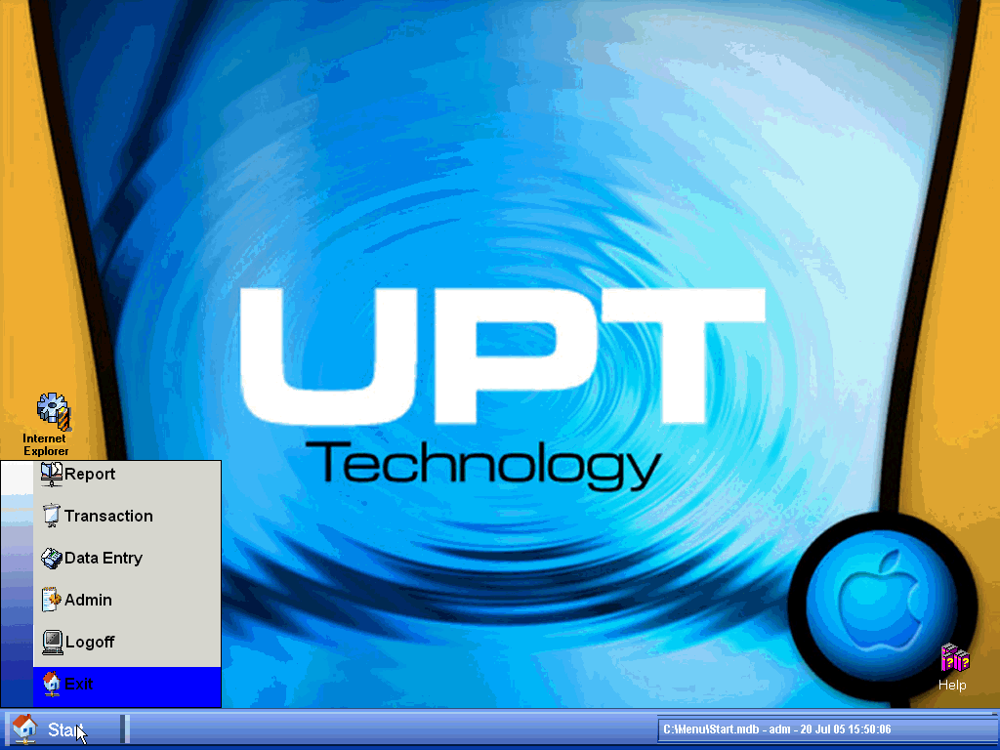



## Win9x/Xp start menu and desktop

### Description

Win9x/Xp start menu and desktop. You can add/delete shortcut to desktop and customize menus for each user.
 
### More Info
 

             |
---                |---
**Submitted On**   |2005-07-06 12:47:56
**By**             |[Agusman Yulianto](https://github.com/Planet-Source-Code/PSCIndex/blob/master/ByAuthor/agusman-yulianto.md)
**Level**          |Intermediate
**User Rating**    |4.3 (17 globes from 4 users)
**Compatibility**  |VB 6\.0
**Category**       |[Custom Controls/ Forms/  Menus](https://github.com/Planet-Source-Code/PSCIndex/blob/master/ByCategory/custom-controls-forms-menus__1-4.md)
**World**          |[Visual Basic](https://github.com/Planet-Source-Code/PSCIndex/blob/master/ByWorld/visual-basic.md)
**Archive File**   |[Win9x\_Xp\_s1915397202005\.zip](https://github.com/Planet-Source-Code/agusman-yulianto-win9x-xp-start-menu-and-desktop__1-61800/archive/master.zip)

